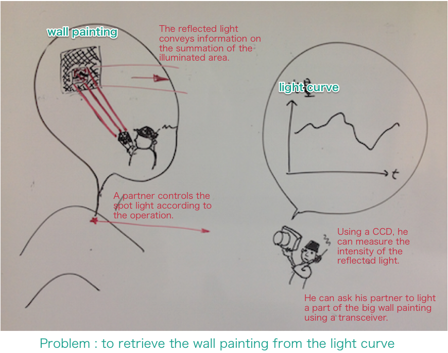
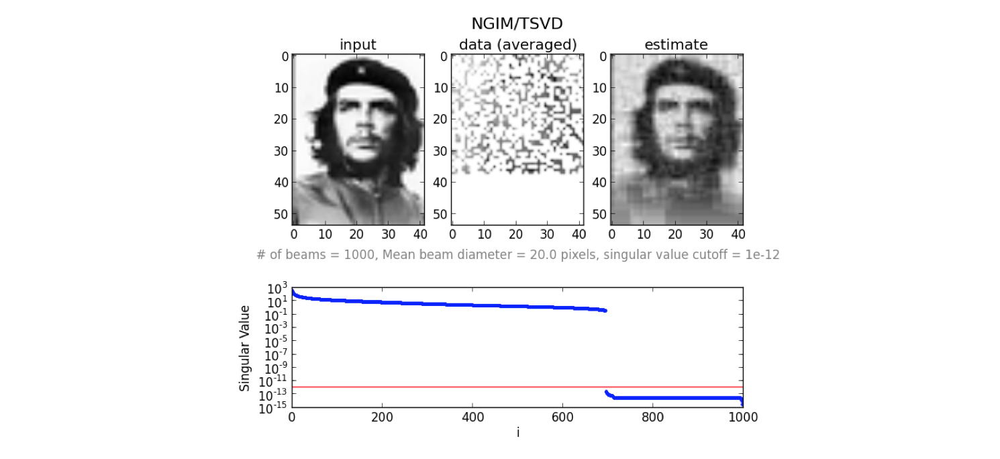
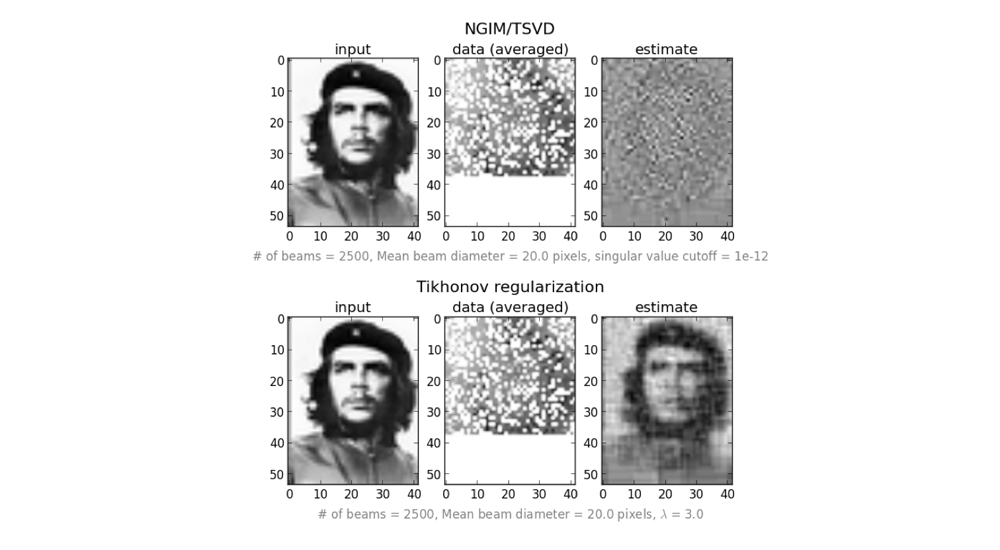
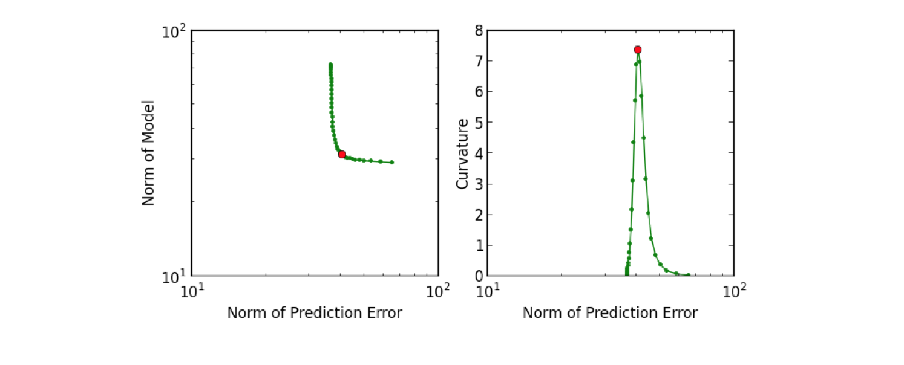

pinvprob
=========

Python codes for the linear inverse problem including the generalized inverse matrix, truncated SVD, Tikhonov regularization, L-curve criterion

Originally I developed Fortran 90 codes of the inverse problem for two papers, 
[Kawahara & Fujii (2011)](http://arxiv.org/abs/1106.0136) and [Fujii & Kawahara (2012)](http://arxiv.org/abs/1204.3504). I converted them to Python codes for the internal seminar of our university.

The algorithm of the L-curve criterion is based on the brilliant book:

* Hansen, P. C. 2010, Discrete Inverse Problems: Insight and Algorithms (the Society for Industrial and Applied Mathema
tics).

I made "random_light.py" as a sample code. This sample code retrieves a small png image from a collection of summation of random rectangle parts of the image. If you use Japanese, see invprov.pdf, otherwise, see the figure below. You will understand the problem of the sample. 

Note that these codes are inefficient when the image size is large because the codes directly use the singular value decomposition. The sample image che.png was taken from Wikipedia and was compressed to a small image.

Requirements
------------------

* python 2.7
* scipy
* pylab
* scikit-learn (only for random_light_fast.py)

Tutorial
-------------------------

* Solve the problem by the Natural Generalized Inverse Matrix (NGIM) with no noise.

~~~~
 ./random_light.py -f che.png -n 1000 -l 0.0 -p 0.7 -w 20.0
~~~~

* Solve the problem by the Natural Generalized Inverse Matrix (NGIM) with an additional noise. The retrieved map is very unstable.

~~~~ 
 ./random_light.py -f che.png -n 2500 -l 0.0 -p 0.7 -s 1.0
~~~~

* Solve the problem by the Tiknov regularization with an additional noise. 

~~~~
 ./random_light.py -f che.png -n 2500 -l 3.0 -p 0.7 -s 1.0
~~~~

* Solve the problem by the Truncated Singular Value Decomposition (TSVD) with an additional noise. 

~~~~
 ./random_light.py -f che.png -n 2500 -l 0.0 -p 0.7 -s 1.0 -lim 1.0
~~~~

* Use the L-curve criterion (Hansen 2010) to look for an appropriate regularization parameter. 

~~~~
 ./random_light.py -f che.png -n 2500 -L 0.01 100.0 -p 0.7 -s 1.0
~~~~

* Fast version of the Tikhonov regularization using scikit-learn (linear_model.Ridge)

This example uses the Ridge Regression in scikit-learn linear_model. It's about ten times faster than np.linalg.svd+tikhonov.py. 

~~~~
 ./random_light_fast.py -f che.png
~~~~

If you want to perform the cross validation (CV), provide the list of lambda. In this case, linear_model.RidgeCV is used to choose the lambda (but usually, smaller value than I expect for the image retrieval).

~~~~
./random_light_fast.py -f che.png -l 1.e-9 1.e-8 1.e-7 1.e-6 1.e-5 -s 1.0
~~~~

You can also try LASSO with or w/o CV... but... anyway try.

~~~~
./random_light_fast.py -f che.png -l 0.001 -solver lasso
~~~~

License
------------

GPL. See "License" in detail. 